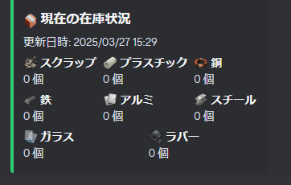

# 📦 Discord在庫管理Bot

このBotは、Discord上で在庫情報をリアルタイムで管理・表示できるツールです。
素材の在庫をカスタム絵文字付きで表示し、UIから簡単に「追加」「削除」できます。

---

## ✅ 主な機能

- 素材の在庫数を自動または手動でEmbed表示
- カスタム絵文字対応
- UIベースの追加・削除操作（セレクトボックス＋モーダル）
- `/在庫` コマンドで現在の在庫を確認
- `/reload` で即時在庫を更新
- 1時間ごとの自動更新投稿
- データは `inventory.json` に保存され、再起動後も保持

---

## 📸 表示イメージ



---

## 🛠️ 使用方法

### 🔹 1. 起動準備
- `Python 3.10+` 推奨
- 必要ライブラリをインストール：
```bash
pip install -U discord.py
```

### 🔹 2. Botトークン設定
コード内の以下を自分のトークンに差し替え：
```python
TOKEN = "YOUR_DISCORD_BOT_TOKEN"
```

### 🔹 3. 起動
```bash
python main.py
```

### 🔹 4. コマンド一覧
- `/在庫`：在庫Embedと操作UIを表示
- `/reload`：現在の在庫状況を即座に再送信

---

## 📦 対応素材一覧（カスタムスタンプ対応）

| 素材         | カスタム絵文字例 |
|--------------|------------------|
| スクラップ   | <:scrap:...>     |
| プラスチック | <:plastic:...>   |
| 銅           | <:copper:...>    |
| 鉄           | <:iron:...>      |
| アルミ       | <:aluminum:...>  |
| スチール     | <:steel:...>     |
| ガラス       | <:glass:...>     |
| ラバー       | <:rubber:...>    |

---

## ⚠️ 注意事項

- このBotはサーバー管理者向けに設計されています。Botをサーバーに招待し、必要な権限（絵文字使用、メッセージ送信）を付与してください。
- カスタム絵文字を使うため、Botがスタンプのあるサーバーにいる必要があります。

---

## 📩 ファイル提供／技術サポート

Botのコードファイル提供や追加機能の相談は、**個別にご連絡ください。**

> 連絡先：Discord `kotoriedit`

---

## © 2025 kotori_dev
